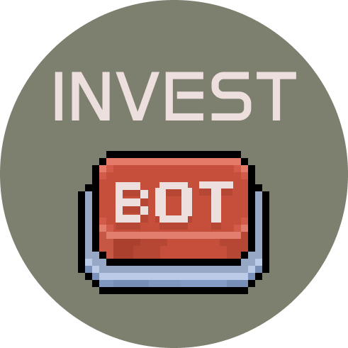
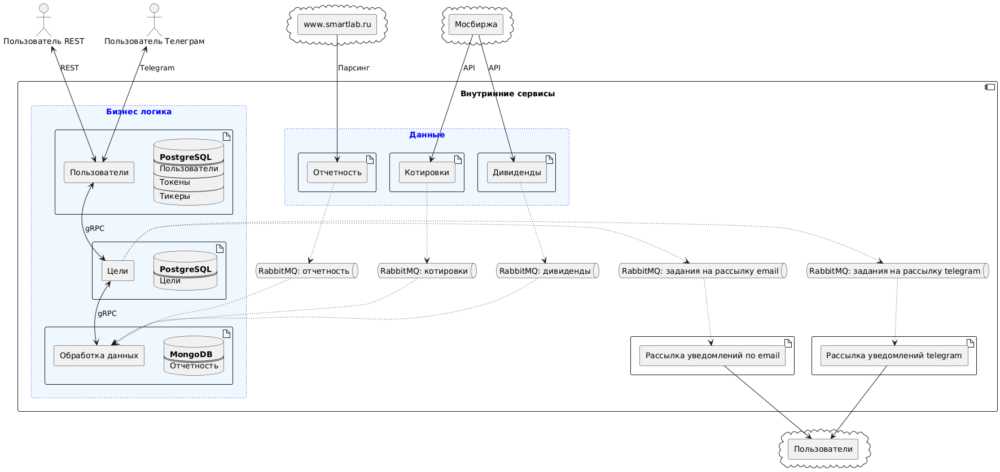
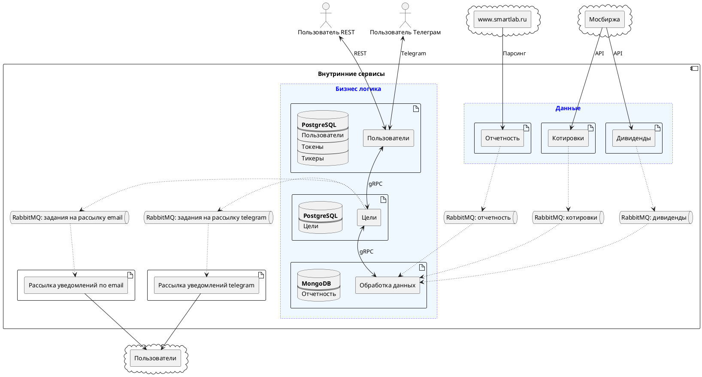

# Робот для инвестора

Приложение рассылает уведомления инвесторам при достижении заданных заранее целей по одному из эмитентов, торгующимся на мосбирже

### ✅ Показатели:

| Индикатор | Параметр        | Расшифровка                  |
|-----------|-----------------|------------------------------|
| P         | P - price       | Цена компании                |
| P / Bv    | Bv - book value | Балансовая стоимость активов |
| P / E     | E - earnings    | Прибыль                      |
| P / S     | S - sales       | Выручка                      |

### 🌐 Сервисы:
- 👤 [Пользователи](https://github.com/akolobaha/fin_api_gateway)
- 📈 [Сбор котировок](https://github.com/akolobaha/fin_quotes)
- 📊 [Сбор отчетности](https://github.com/akolobaha/fin_fundamentals)
- 🚚 [Транспорт](https://github.com/akolobaha/fin_transport)
- ⚙️ [Обработка данных](https://github.com/akolobaha/fin_data_processing)
- ✉️ [Рассылка email-уведомлений](https://github.com/akolobaha/fin_notifications)
- 📱 [Рассылка telegram-уведомлений](https://github.com/akolobaha/fin_notifications_telegram)

